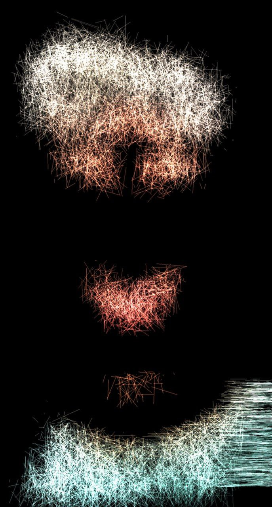

thanks to [FTD](https://github.com/FollowTheDarkside) for the code idea and code [Original Particle Audio Visualizer](https://github.com/FollowTheDarkside/threejs-webcam-particle-visualizer) repository.  

## 📹 Demo

you can test it in [live Demo](https://www.mml-dev.ir/wenodes/).

| PNG Thumbnail | GIF Preview |
|---------------|------------|
|  ||

Particle Audio Visualizer

This web-based application allows users to control and visualize a particle system in real-time, synchronized with audio. The visualizer reacts to audio frequencies, providing an interactive and dynamic experience. You can adjust the visual effects using sliders, randomize the settings, and even capture frames of the animation.

Features

Real-time Audio Visualization: Synchronize particle effects with the audio playthrough.

Customizable Parameters: Use sliders to adjust parameters such as:

Height Scale

Threshold

Noise Amount

Animation Controls: Trigger smooth animations of the visualizer effects with each beat of the audio (kick and snare).

Frame Capture: Download frames of the visualizer as images.

Randomize Settings: Randomize all slider values for a new visual effect.

How to Use

Adjust Parameters:

Use the sliders to control the Height Scale, Threshold, and Noise Amount of the particle system.

Play Audio:

Press the play button on the embedded audio player to begin the visualization. The particle system will react to the audio's beats (kick and snare).

Capture Frame:

Press the "Download Frame" button to capture the current frame of the visualizer and save it as an image.

Randomize:

Click "Randomize Sliders" to change all parameters to random values and view a fresh visualization.

Some code snippets and ideas were adapted with permission under the [MIT License](https://opensource.org/licenses/MIT).
